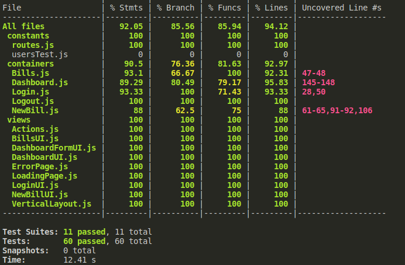

## Débuggez et testez un SaaS RH
_Projet 9 - Billed - Juillet 2022_


## résultat des test en place



## Compétences évaluées  

* Ecrire des tests unitaires avec JavaScript
* Débugger une application web avec le Chrome Debugger
* Rédiger un plan de test end-to-end manuel
* Ecrire des tests d'intégration avec JavaScript


## L'architecture du projet :
Ce projet, dit frontend, est connecté à un service API backend que vous devez aussi lancer en local.

Le projet backend se trouve ici: https://github.com/OpenClassrooms-Student-Center/Billed-app-FR-back

## Comment lancer l'application en local ?

### étape 1 - Lancer le backend :

Suivez les indications dans le README du projet backend.

### étape 2 - Lancer le frontend :

Allez au repo cloné :
```
$ cd Billed-app-FR-Front
```

Installez les packages npm (décrits dans `package.json`) :
```
$ npm install
```

Installez live-server pour lancer un serveur local :
```
$ npm install -g live-server
```

Lancez l'application :
```
$ live-server
```

Puis allez à l'adresse : `http://127.0.0.1:5500/`


## Comment lancer tous les tests en local avec Jest ?

```
$ npm run test
```

## Comment lancer un seul test ?

Installez jest-cli :

```
$npm i -g jest-cli
$jest src/__tests__/your_test_file.js
```

## Comment voir la couverture de test ?

`http://127.0.0.1:5500/coverage/lcov-report/`

## Comptes et utilisateurs :

Vous pouvez vous connecter en utilisant les comptes:

### administrateur : 
```
utilisateur : admin@test.tld 
mot de passe : admin
```
### employé :
```
utilisateur : employee@test.tld
mot de passe : employee
```
